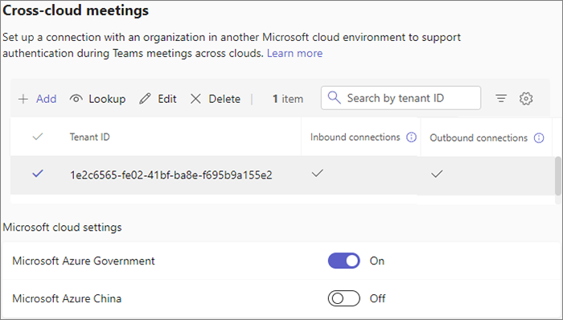

# Meet with people in other Microsoft 365 cloud environments (Preview)

There are three options for users to join meetings between your organization and an organization in a different Microsoft 365 cloud environment (such as commercial and GCC):

- Authenticated access using a cross-cloud meeting connection
- [Authenticated access using a guest account](/microsoft-365/solutions/collaborate-guests-cross-cloud)
- [Anonymous access](anonymous-users-in-meetings.md)

This article covers authenticated meeting access using a cross-cloud meeting connection. This is similar to in-cloud meetings using [external access](trusted-organizations-external-meetings-chat.md) in that participants can join meetings as authenticated participants without requiring guest accounts in the other organization. (Cross-cloud meetings don't require external access to be configured.)

With cross-cloud meeting connections, you can allow or prevent meetings between your organization and an organization in another cloud. Cross-cloud meeting connections use organizational relationships defined in [cross-tenant access settings in Azure AD](/azure/active-directory/external-identities/cross-tenant-access-settings-b2b-collaboration).

If a cross-tenant connection between organizations already exists in Azure AD cross-tenant access settings, it will appear in meeting settings in the Teams admin center. You can edit this connection to choose if meetings are allowed between the two tenants.

If the connection doesn't exist, you can add it in Teams meeting settings. This will add a new organization in the cross-tenant access settings in Azure AD using the [default settings that you've defined for inbound and outbound access and tenant restrictions](/azure/active-directory/external-identities/cross-tenant-access-settings-b2b-collaboration#configure-default-settings). (This will enable B2B collaboration with the other organization if the defaults allow it.)

> [!IMPORTANT]
> The organization that you're meeting with must also configure these settings for their organization.

## Allow cross-tenant connections with other Microsoft 365 cloud environments

If you're setting up a cross-cloud meeting connection with a tenant that's in a different Microsoft Azure cloud environment than yours, then you need to enable connections with that cloud before you set up the meeting connection itself.

The following table shows which Microsoft Azure cloud environment your Microsoft 365 cloud environment is located in.

|Microsoft Azure cloud environment|Microsoft 365 cloud environment|
|:--------------------------------|:------------------------------|
|Microsoft Azure Commercial|Commercial, GCC|
|Microsoft Azure Government|GCC High, DoD|
|Microsoft Azure China|China (21Vianet)|

If you're setting up a cross-cloud meeting connection with a tenant in a different Microsoft Azure cloud environment, enable that cloud environment in meeting settings.

1. In the Teams admin center, expand **Meetings**, and then select **Meeting settings**.
1. Under **Microsoft cloud settings**, make sure the Microsoft Azure cloud environment you need to connect to is set to **On**.
    > [!NOTE]
    > This is the same as the [Microsoft cloud settings in Azure AD cross-tenant access settings](/azure/active-directory/external-identities/cross-cloud-settings).

## Add a new cross-cloud meeting connection

To create a new cross-cloud meeting connection, you need the tenant ID or the fully qualified domain name for the organization that you want to meet with. Note that meetings between tenants in Microsoft Azure Government (Microsoft 365 GCC High and DoD) can't create a cross-cloud meeting connection with tenants in Microsoft Azure China.

Add a cross-cloud meeting connection

1. In the Teams admin center, expand **Meetings**, and then select **Meeting settings**.
1. Under **Cross-cloud meetings**, select **Add**.
1. Type the Tenant ID of the organization you want to connect to or look it up by using the fully qualified domain name.
1. If you want to allow users in the other organization to attend meetings hosted by your organization, set **Inbound connections** to **On**.
1. If you want to allow users in your organization to attend meetings in the other organization, set **Outbound connections** to **On**.

    

## Edit a cross-cloud meeting connection

To edit a cross-cloud meeting connection, you need the tenant ID or the fully qualified domain name for the organization that you want to meet with. The list of tenants in meeting settings shows the tenant ID, but you can use the **Lookup** option to search by fully qualified domain name and find the correct tenant ID in the list.

Edit a cross-cloud meeting connection

1. In the Teams admin center, expand **Meetings**, and then select **Meeting settings**.
1. Under **Cross-cloud** meetings, select the tenant you want to update, and then select **Edit**.
1. Update the connection settings that you want to change, and then select **Save**.

## Related topics

[Collaborate with guests from other Microsoft clouds](/microsoft-365/solutions/collaborate-guests-cross-cloud)

[Manage external access in Teams](manage-external-access.md)
